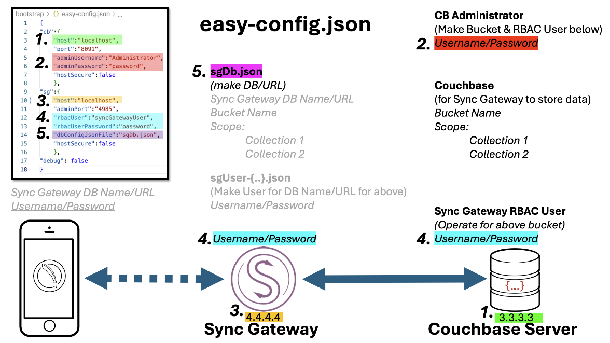
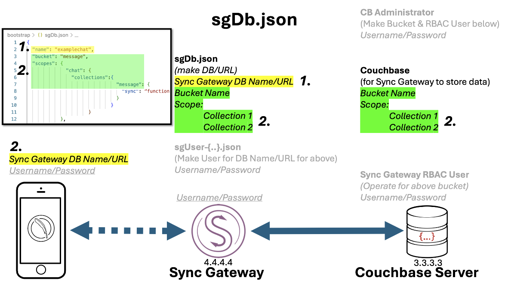
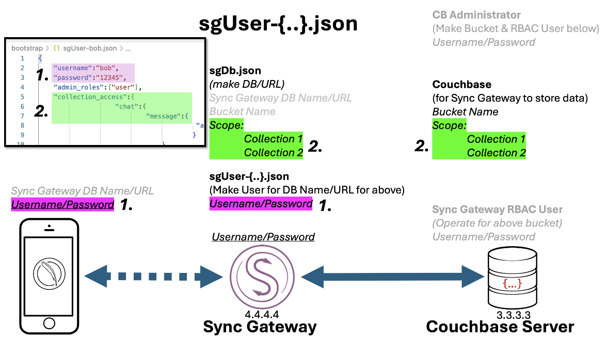

This script makes it easy to setup and configue a demo of a Couchbase Mobile Application.

`easy-deploy.py` will:

- CREATE Couchbase a Bucket , Scope and Collections for Sync Gateway to use.
- CREATE Sync Gateway RBAC User in Couchbase Server so Sync Gateway can read and write data into above Bucket , Scope and Collections.
- CREATE Sync Gateway Database / URL and connect it to above Bucket , Scope and Collections
- CREATE Sample/Test users for Couchbase Lite to connect to Sync Gateway via `sgUser-{name}.json` files.
<br/>
<br/>
<br/>

# STEP 1 - UPDATE `easy-config.json` with your values IMAGE BELOW


<br/>
<br/>
<br/>


# STEP 2 - UPDATE `sgDb.json` with your values IMAGE BELOW



<br/>
<br/>
<br/>

# STEP 3 - RUN the Python Script

**NOTE** Your Sync Gateway should be running just like Couchbase Server. Click this link for more on <a href="https://docs.couchbase.com/sync-gateway/current/get-started-install.html" target="_blank">Installing & Running Sync Gateway</a>

Attached is a sample Sync Gateway config file to get started:  `basic-couchbase-bucket-xattr.json`


``` terminal
python3 easy-config.py easy-config.json
```
<br/>
<br/>
<br/>

## Optional
