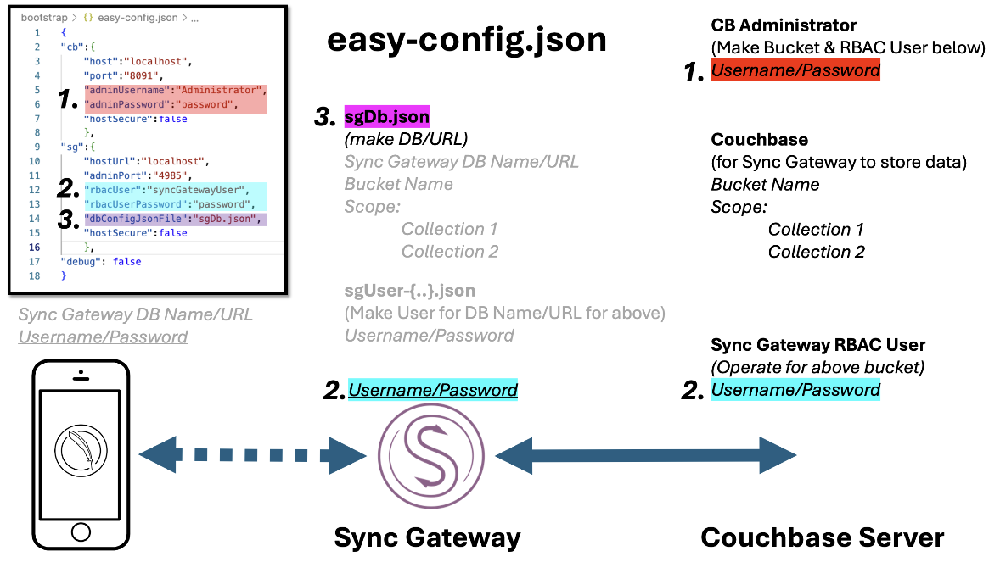
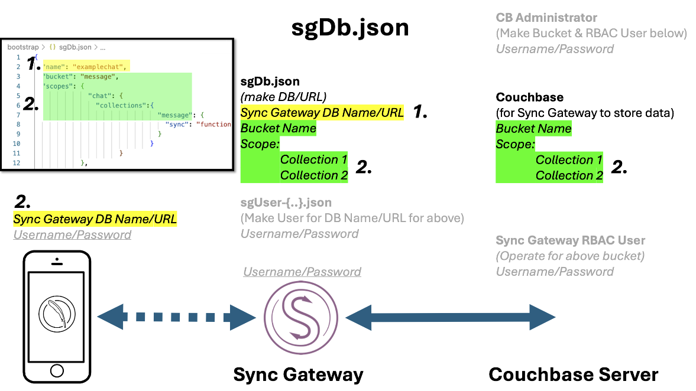
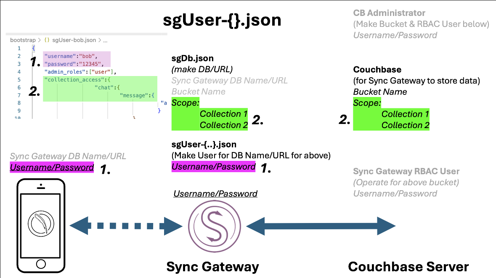

## STEP 1 - UPDATE `easy-config.json` with your values IMAGE BELOW



## STEP 2 - UPDATE `sgDb.json` with your values IMAGE BELOW




## STEP 3 - RUN the Python Script

``` terminal
# python3 easy-config.py easy-config.json
```

## Optional
